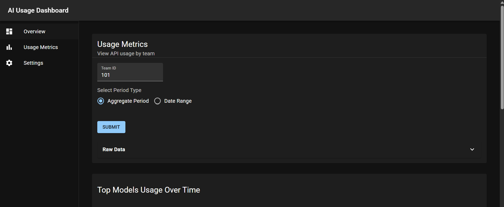
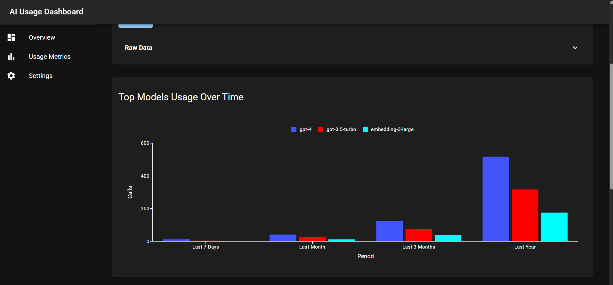
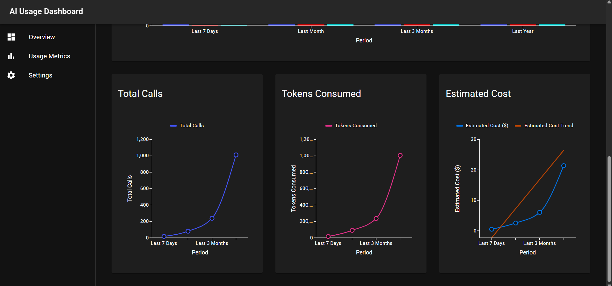

# 📊 AI Usage Dashboard — Architecture & Design Overview

This project is a full‑stack demo application that displays AI platform usage metrics for a team. It consists of a .NET Core Web API backend and a React Router + MUI frontend, designed to showcase clean architecture, maintainability, responsive UI, good abstractions, and accessible data visualization.

## 🏗️ Backend: ASP.NET Core Web API

The backend is implemented using ASP.NET Core Web API, chosen for its robustness, maintainability, and strong ecosystem. This framework was also chosen because I am especially familiar with it. Similar to frameworks like Java Spring Boot, ASP.NET Core provides:

- Built‑in request handling and validation
- First‑class dependency injection
- Strong typing and compile‑time safety
- Excellent performance and scalability
- A large, active community and long‑term support
- A structure that naturally encourages clean, maintainable architecture

The API has also been built with abstractions such as controllers, services, and repositories, as well as interfaces.

### ASP.NET Core Web API Trade‑offs

Some trade-offs of this framework include:

- ASP.NET Core is more opinionated than lightweight frameworks such as Express.js or Flask, meaning less customization, though this may also be viewed as beneficial depending on preference and use case.
- Other frameworks, in particular Node‑based frameworks can be more efficient for handling large volumes of concurrent asynchronous requests, which may be beneficial for high‑traffic real‑time systems.

### Future Improvements for Backend

If this API were deployed in a production environment with heavy usage, it would likely benefit from horizontal scaling like a load balancer to distribute asynchronous network traffic across multiple backend instances. It could be further improved by using an in memory data store like Redis as a cache for the usage metric results.

### Instructions to Run ASP.Net Core Web API

Open AIBackendAPI folder in VSCode.

In VSCode do: ```Run > Start Debugging``` OR ```Run > Start Without Debugging```.

Or in console run:

```bash
dotnet run .
```

### Instructions to Run ASP.Net Core Web API Tests

This web API requires .NET 10.

Open root folder (e.g., AIDashboard) and in the console run:

```bash
dotnet test
```

Or open AIBackendAPI.Tests folder in VSCode.

In VSCode do: ```Run > Start Debugging``` OR ```Run > Start Without Debugging```.

## 🗄️ Database Layer

For this project, the application uses the EF Core InMemory database provider. The reasons for this include:

- Little setup required
- Fast and lightweight
- Ideal for demos, prototypes, and local development
- No external dependencies for reviewers or testers

### Database Provider Trade‑offs

- Data is not persisted — it disappears when the application stops
- It lacks the robustness and reliability of production‑grade providers such as SQL Server or PostgreSQL

### Future Improvements for Database Layer

With more time, a more realistic setup could include:

- A Dockerized PostgreSQL instance for local development
- A cloud‑hosted database for production (Azure SQL, AWS RDS, etc.)
- A NoSQL database (MongoDB, Cosmos DB, DynamoDB) if horizontal scaling becomes more important

## 🎨 Frontend: React Router + MUI

The frontend is built using React Router and Material UI (MUI).
Some reasons why React Router was chosen include:

- Simple, easy to setup routing
- Hot reloading for quick development
- Built‑in support for data loaders, enabling asynchronous data fetching during navigation
- Faster perceived performance because charts render with data immediately on page load thanks to the loaders

Some reasons why MUI was chosen include:

- Clean, customizable, and modern UI components based on Google's Material Design
- Automatic support for light/dark mode
- Strong accessibility focus — MUI is “Dedicated to accessibility”
- A rich ecosystem including MUI X Charts, used for the data visualizations

The frontend also uses an AIUsageClient (in aiUsageClient.ts) that abstracts the API fetch calls and caches results.

### Instructions to Run Frontend

Open Frontend in VSCode.

In the console run:

```bash
npm i
npm run dev
```

### Accessibility Considerations

The chart color palette was intentionally curated to meet WCAG 2.1 AA contrast requirements in both dark and light mode, verified using the WebAIM Contrast Checker:
<https://webaim.org/resources/contrastchecker>. No accessibility issues were found with Axe Devtools accessibility scans either.
This ensures the dashboard is usable for individuals with visual impairments or color‑vision deficiencies.

### Future Improvements for Frontend

Although this demo runs entirely on a local development environment, a production deployment would benefit from using a Content Delivery Network (CDN) to serve the frontend's static assets. The CDN would allow for:

- Faster load times by allowing users to download the React build files from a server geographically close to them.
- Better caching since CDN edge nodes automatically cache some build artifacts like assets/*.js.

## 🧠 Assumptions

This project makes several assumptions to keep the scope manageable:

- Data volume is moderate, suitable for in‑memory storage in a demo context.
- The database tables are already populated.
  - Probably by some weekly Quartz scheduled task that inserts data for each weekly period (i.e., $"year-{yearNum}-week-{week}"), and updates the aggregate period entries (i.e., last 7 days, last month, last 3 months, last year)
- The dashboard is primarily informational, not requiring real‑time updates or streaming.
- Users access the dashboard via modern browsers that support ES6+ and CSS Grid.
- Accessibility is a priority, so color choices and component structure follow WCAG guidelines.
- The API is trusted, so authentication/authorization is out of scope for this demo.

## 🚀 Conclusion

This dashboard demonstrates a clean, maintainable, accessible, and responsive approach to visualizing AI usage metrics. The chosen technologies balance developer experience, performance, and clarity while keeping the setup simple for reviewers. With additional time, the architecture could be extended to include persistent production grade storage, authentication, real‑time updates, and more scalability.

## Screenshots




